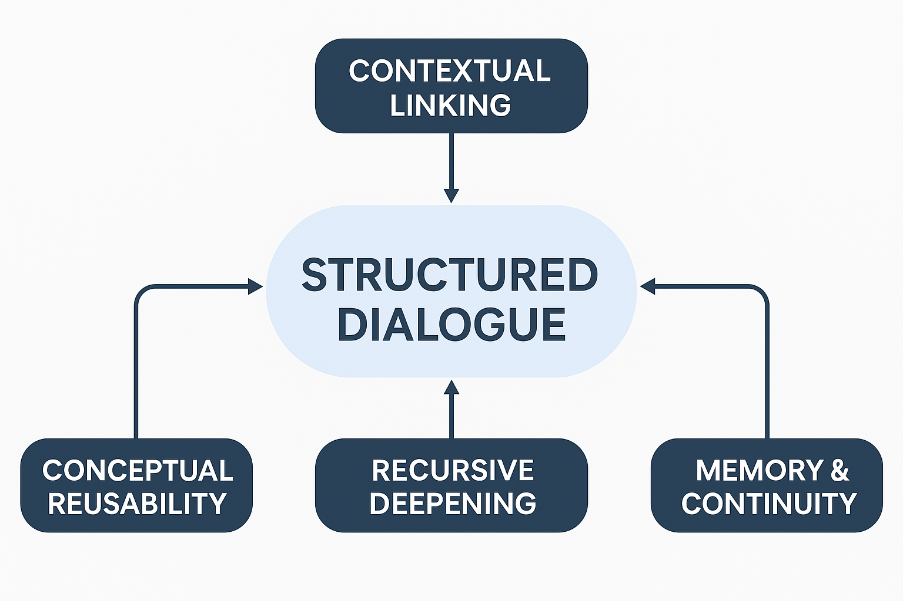
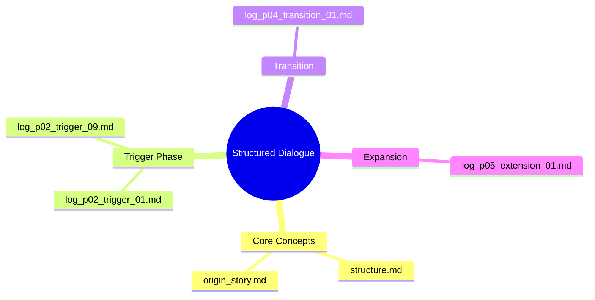

# Structured Dialogue: A Framework for Collaborative Thinking with Generative AI

Structured Dialogue is an interaction methodology that enables AI and humans to co-develop ideas through recursive, context-aware dialogue. This repository provides a full framework: prompts, logs, dialogue maps, and design principles to apply structured dialogue across creative, technical, and academic domains.

Rather than treating AI as a mere tool, Structured Dialogue invites it as a "thinking companion"?capable of retaining evolving contexts, triggering insights, and enabling reproducible knowledge creation.

[Read this page in Japanese Å®](README_ja.md)

---

## Overview

This repository captures the practical evolution of Structured Dialogue through recorded interactions, conceptual frameworks, and experimental logs. It demonstrates how structured, long-form conversation with generative AI can:

* Clarify ambiguous or abstract ideas
* Preserve and develop long-term goals
* Produce reusable knowledge assets

Structured Dialogue treats interaction history as a resource, not noise?enabling recursive refinement and knowledge propagation.

---

## What is Structured Dialogue?

### Definition

Structured Dialogue is a context-preserving interaction between a human and an AI model, where each exchange builds upon prior structure. Unlike prompt engineering templates or one-shot instructions, it:

* Tracks evolving goals and context over time
* Enables shared exploration of open-ended topics
* Supports recursive reformulation and structural abstraction

### Background

Traditional prompting isolates queries. In contrast, Structured Dialogue treats interactions as co-evolving thought processes?suitable for tasks that span multiple iterations, like design, ideation, or research.

---

## Current Phase: Structured Propagation and Restartability

Structured Dialogue has reached a stage where entire dialogue histories can:

* Be **restarted** from any save point ([state\_latest.md](./docs/state_latest.md))
* Be **transferred** across AI models (e.g., GPT, Claude, Gemini, Grok)
* Serve as **reproducible thinking artifacts**, preserving reasoning and exploration paths ([log\_index.md](./logs/log_index.md))

The system is no longer experimental; it is a working framework for traceable and restartable dialogue design.

---

## Core Artifacts

These documents define the theory and implementation base:

* [`structure.md`](./docs/structure.md): The 5-layer dialogue structure, with MCP comparison
* [`origin_story.md`](./docs/origin_story.md): Historical background and concept emergence
* [`prompt_examples.md`](./docs/prompt_examples.md): Templates for different dialogue phases
* [`model_cross_dialogue.md`](./docs/model_cross_dialogue.md): Multi-model comparison logs (Claude, Gemini, etc.)
* [`log_index.md`](./logs/log_index.md): The complete dialogue map
* [`state_latest.md`](./docs/state_latest.md): The latest save snapshot

---

## Dialogue Phases and Key Logs

### Å° Discovery Phase

* `log_p00_discovery_01.md` Å® Initial concept emergence
* `log_p00_discovery_02.md` Å® Naming and defining Structured Dialogue

### Å° Structural Trigger Phase

* `log_p02_trigger_01.md` Å® Testing inheritance via Claude
* `log_p02_trigger_09.md` Å® Re-evaluation and social framing

### Å° Transition Phase

* `log_p04_transition_01.md` Å® Shift in format and naming, post-propagation

### Å° Extension Phase

* `log_p05_extension_01.md` Å® Thought expansion via Gemini misgeneration
* `log_p05_extension_03.md` Å® Prompt personality and OS inheritance via Claude 4

---

## Visual Overview

---

## Implementation Directions

This repository includes:

* Dialogue logs and structural snapshots
* Prompts for initializing phase-aware sessions
* Memory-compatible restart procedures
* Experimental data from AI-to-AI interaction

---

## Future Work

* Visualization tools for dialogue structure
* Integration with memory/agent-based systems
* Use in educational and technical training
* Evaluating reproducibility across diverse models

---

## License

This project is under the MIT License. See `LICENSE` for details.

