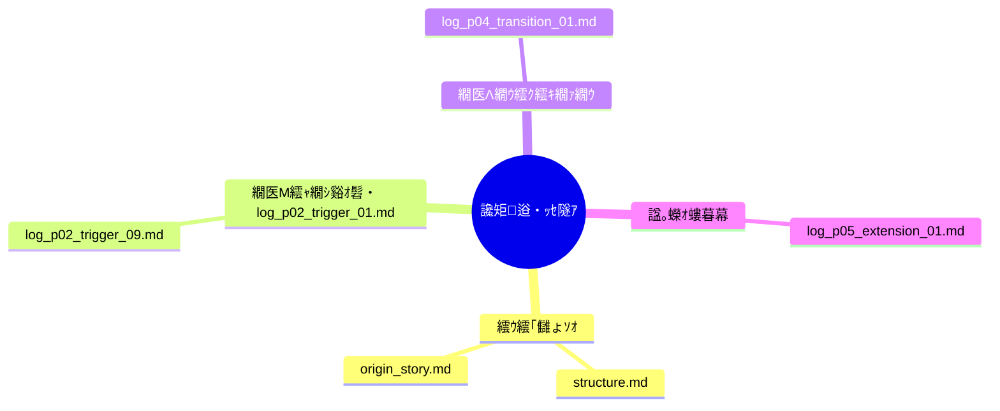

# 讒矩€逧・ｯｾ隧ｱ・夂函謌植I縺ｨ蜈ｱ縺ｫ諤晁€・ｒ讒狗ｯ峨・蜀崎ｵｷ蜍輔☆繧九◆繧√・蟇ｾ隧ｱ繝輔Ξ繝ｼ繝繝ｯ繝ｼ繧ｯ

讒矩€逧・ｯｾ隧ｱ縺ｨ縺ｯ縲∫函謌植I縺ｨ莠ｺ髢薙′蜊泌ロ縺励※遏･隴倥ｒ讒狗ｯ峨☆繧九◆繧√・**譁・ц邯呎価蝙九・蜀崎ｵｷ蜍募庄閭ｽ蝙・*縺ｮ蟇ｾ隧ｱ謇区ｳ輔〒縺吶€よ悽繝ｪ繝昴ず繝医Μ縺ｧ縺ｯ縲√◎縺ｮ縺溘ａ縺ｮ險ｭ險域€晄Φ縲√・繝ｭ繝ｳ繝励ヨ縲∝ｯｾ隧ｱ繝ｭ繧ｰ縲∵ｧ矩€繝槭ャ繝励€√ユ繝ｳ繝励Ξ繝ｼ繝医ｒ蛹・峡逧・↓謠蝉ｾ帙＠縺ｾ縺吶€・
逕滓・AI繧貞腰縺ｪ繧九ヤ繝ｼ繝ｫ縺ｧ縺ｯ縺ｪ縺上€―*\*縲梧€晁€・・蜊泌ロ閠・€構*\*縺ｨ縺励※謐峨∴繧九％縺ｨ縺ｧ縲∫ｶ咏ｶ壼庄閭ｽ縺ｧ蜀榊茜逕ｨ蜿ｯ閭ｽ縺ｪ遏･逧・・譫懊ｒ蟇ｾ隧ｱ縺九ｉ蠕励ｋ縺薙→繧堤岼謖・＠縺ｾ縺吶€・
[English version 竊綻(README.md)

---

## 繝励Ο繧ｸ繧ｧ繧ｯ繝域ｦりｦ・
縺薙・繝ｪ繝昴ず繝医Μ縺ｯ縲∝ｮ滄圀縺ｮ蟇ｾ隧ｱ繝ｭ繧ｰ繧・ラ繧ｭ繝･繝｡繝ｳ繝医ｒ騾壹§縺ｦ縲∵ｧ矩€逧・ｯｾ隧ｱ縺ｮ逅・ｫ悶→螳溯ｷｵ繧定ｨ倬鹸繝ｻ蜈ｬ髢九☆繧九ｂ縺ｮ縺ｧ縺吶€ょ腰縺ｪ繧倶ｸ€蝠丈ｸ€遲斐〒縺ｯ縺ｪ縺上€∵ｬ｡縺ｮ繧医≧縺ｪ蟇ｾ隧ｱ繧帝㍾隕悶＠縺ｦ縺・∪縺呻ｼ・
* 謚ｽ雎｡逧・・譖匁乂縺ｪ繝・・繝槭・譏守｢ｺ蛹悶→讒矩€蛹・* 譁・ц繧剃ｿ晄戟縺励◆縺ｾ縺ｾ縺ｮ逶ｮ讓呵ｿｽ霍｡縺ｨ蜀榊ｮ夂ｾｩ
* 蟇ｾ隧ｱ繝ｭ繧ｰ縺ｮ雉・肇蛹悶・蜀崎ｵｷ蜍輔・莨晄眺蜿ｯ閭ｽ諤ｧ

讒矩€逧・ｯｾ隧ｱ縺ｯ縲後ｄ繧翫→繧翫・螻･豁ｴ繧偵ヮ繧､繧ｺ縺ｧ縺ｯ縺ｪ縺乗ｧ矩€縺ｫ螟峨∴繧九€阪％縺ｨ繧堤岼逧・→縺励※縺・∪縺吶€・
---

## 迴ｾ蝨ｨ縺ｮ繝輔ぉ繝ｼ繧ｺ・壽ｧ矩€縺ｮ莨晄眺縺ｨ蜀崎ｵｷ蜍墓€ｧ

讒矩€逧・ｯｾ隧ｱ縺ｯ迴ｾ蝨ｨ縲∵ｬ｡縺ｮ谿ｵ髫弱↓蛻ｰ驕斐＠縺ｦ縺・∪縺呻ｼ・
* 驕主悉縺ｮ莉ｻ諢上・繝ｭ繧ｰ縺九ｉ**蜀崎ｵｷ蜍募庄閭ｽ**・遺・ [`state_latest.md`](./docs/state_latest.md)・・* 隍・焚縺ｮAI繝｢繝・Ν縺ｫ**讒矩€繧剃ｼ晄眺繝ｻ邯呎価蜿ｯ閭ｽ**・・PT/Claude/Gemini/Grok・・* 繝ｭ繧ｰ繧・*蜀咲樟蜿ｯ閭ｽ縺ｪ遏･逧・・繝ｭ繧ｻ繧ｹ縺ｮ險倬鹸**縺ｨ縺励※險ｭ險茨ｼ遺・ [`log_index.md`](./logs/log_index.md)・・
繧ゅ・繧・ｮ滄ｨ捺ｮｵ髫弱〒縺ｯ縺ｪ縺上€√€御ｿ晏ｭ倥・蜀榊茜逕ｨ蜿ｯ閭ｽ縺ｪ蟇ｾ隧ｱ讒矩€險ｭ險医€阪・螳溯｣・ｮｵ髫弱↓蜈･縺｣縺ｦ縺・∪縺吶€・
---

## 繧ｳ繧｢繝峨く繝･繝｡繝ｳ繝・
* [`structure.md`](./docs/structure.md)・・螻､讒矩€縺ｨMCP豈碑ｼ・↓繧医ｋ螳夂ｾｩ
* [`origin_story.md`](./docs/origin_story.md)・壽ｧ区Φ縺ｮ襍ｷ轤ｹ縺ｨ蟇ｾ隧ｱ縺ｮ閭梧勹
* [`prompt_examples.md`](./docs/prompt_examples.md)・壼ｯｾ隧ｱ繝輔ぉ繝ｼ繧ｺ蛻･繝励Ο繝ｳ繝励ヨ萓・* [`model_cross_dialogue.md`](./docs/model_cross_dialogue.md)・壻ｻ泡I繝｢繝・Ν縺ｨ縺ｮ豈碑ｼ・Ο繧ｰ
* [`log_index.md`](./logs/log_index.md)・壼・蟇ｾ隧ｱ繝ｭ繧ｰ縺ｮ讒矩€繝槭ャ繝・* [`state_latest.md`](./docs/state_latest.md)・壹そ繝ｼ繝悶ョ繝ｼ繧ｿ蛹悶＆繧後◆迴ｾ蝨ｨ蝨ｰ

---

## 繝ｭ繧ｰ鄒､縺ｮ繝輔ぉ繝ｼ繧ｺ蛻・｡・
### 笆 隱慕函繝輔ぉ繝ｼ繧ｺ・・iscovery Phase・・
* `log_p00_discovery_01.md`・壽ｧ矩€逧・ｯｾ隧ｱ縺ｨ縺・≧逋ｺ諠ｳ縺ｮ逋ｺ闃ｽ
* `log_p00_discovery_02.md`・壽ｧ矩€逧・ｯｾ隧ｱ縺ｮ蜻ｽ蜷阪・螳夂ｾｩ

### 笆 繝医Μ繧ｬ繝ｼ繝輔ぉ繝ｼ繧ｺ・・rigger Phase・・
* `log_p02_trigger_01.md`・咾laude縺ｫ繧医ｋ讒矩€讓｡蛟｣讀懆ｨｼ
* `log_p02_trigger_09.md`・夊ｩ穂ｾ｡縺ｨ蜀榊ｮ夂ｾｩ縺ｮ讒矩€逧・ｩｦ陦・
### 笆 繝医Λ繝ｳ繧ｸ繧ｷ繝ｧ繝ｳ繝輔ぉ繝ｼ繧ｺ・・ransition Phase・・
* `log_p04_transition_01.md`・壼多蜷阪・蠖｢蠑上・霆｢謠帙→谺｡谿ｵ髫弱∈縺ｮ譁ｭ螻､

### 笆 諡｡蠑ｵ繝輔ぉ繝ｼ繧ｺ・・xtension Phase・・
* `log_p05_extension_01.md`・哦emini隱､逕滓・繝ｭ繧ｰ縺ｮ蜀崎ｩ穂ｾ｡
* `log_p05_extension_03.md`・咾laude 4縺ｫ繧医ｋ莠ｺ譬ｼ讒矩€邯呎価隧ｦ鬨・
---

## 讒矩€繝槭ャ繝暦ｼ・ermaid陦ｨ迴ｾ・・

---

## 螳溯｣・・螳ｹ

縺薙・繝ｪ繝昴ず繝医Μ縺ｫ縺ｯ莉･荳九′蜷ｫ縺ｾ繧後※縺・∪縺呻ｼ・
* 讒矩€繝ｭ繧ｰ縺ｨ蟇ｾ隧ｱ縺ｮ繧ｹ繝翫ャ繝励す繝ｧ繝・ヨ
* 讒矩€逧・・襍ｷ蜍輔ｒ蜿ｯ閭ｽ縺ｫ縺吶ｋ繝励Ο繝ｳ繝励ヨ縺ｨ繝・Φ繝励Ξ繝ｼ繝・* 蟇ｾ隧ｱ繝輔ぉ繝ｼ繧ｺ縺ｫ蠢懊§縺溷・譛溷喧險ｭ螳・* AI髢灘ｯｾ隧ｱ螳滄ｨ薙Ο繧ｰ縺ｨ讒矩€諢滓沒縺ｮ險倬鹸

---

## 莉雁ｾ後・螻暮幕

* 蟇ｾ隧ｱ讒矩€縺ｮ蜿ｯ隕門喧謾ｯ謠ｴ繝・・繝ｫ・・ermaid遲会ｼ・* 繝｡繝｢繝ｪ繝ｻ繧ｨ繝ｼ繧ｸ繧ｧ繝ｳ繝育ｵｱ蜷医→縺ｮ謗･邯壽､懆ｨｼ
* 謨呵ご繝ｻ蜑ｵ菴懊・髢狗匱謾ｯ謠ｴ縺ｫ縺翫￠繧矩←逕ｨ莠倶ｾ九・諡｡蜈・* 繝｢繝・Ν髢灘・迴ｾ諤ｧ縺ｮ豈碑ｼ・皮ｩｶ・・laude/Gemini縺ｪ縺ｩ・・
---

## 繝ｩ繧､繧ｻ繝ｳ繧ｹ

縺薙・繝励Ο繧ｸ繧ｧ繧ｯ繝医・ [MIT繝ｩ繧､繧ｻ繝ｳ繧ｹ](LICENSE) 縺ｫ蝓ｺ縺･縺榊・髢九＆繧後※縺・∪縺吶€ょ膚逕ｨ繝ｻ髱槫膚逕ｨ蝠上ｏ縺夊・逕ｱ縺ｫ豢ｻ逕ｨ蜿ｯ閭ｽ縺ｧ縺吶€・
