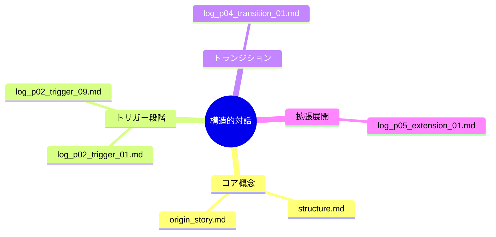

# 構造的対話：生成AIと共に思考を構築・再起動するための対話フレームワーク

構造的対話とは、生成AIと人間が協働して知識を構築するための**文脈継承型・再起動可能型**の対話手法です。本リポジトリでは、そのための設計思想、プロンプト、対話ログ、構造マップ、テンプレートを包括的に提供します。

生成AIを単なるツールではなく、\*\*「思考の協働者」\*\*として捉えることで、継続可能で再利用可能な知的成果を対話から得ることを目指します。

[English version →](README.md)

---

## プロジェクト概要

このリポジトリは、実際の対話ログやドキュメントを通じて、構造的対話の理論と実践を記録・公開するものです。単なる一問一答ではなく、次のような対話を重視しています：

* 抽象的・曖昧なテーマの明確化と構造化
* 文脈を保持したままの目標追跡と再定義
* 対話ログの資産化・再起動・伝播可能性

構造的対話は「やりとりの履歴をノイズではなく構造に変える」ことを目的としています。

---

## 現在のフェーズ：構造の伝播と再起動性

構造的対話は現在、次の段階に到達しています：

* 過去の任意のログから**再起動可能**（→ [`state_latest.md`](./docs/state_latest.md)）
* 複数のAIモデルに**構造を伝播・継承可能**（GPT/Claude/Gemini/Grok）
* ログを**再現可能な知的プロセスの記録**として設計（→ [`log_index.md`](./logs/log_index.md)）

もはや実験段階ではなく、「保存・再利用可能な対話構造設計」の実装段階に入っています。

---

## コアドキュメント

* [`structure.md`](./docs/structure.md)：5層構造とMCP比較による定義
* [`origin_story.md`](./docs/origin_story.md)：構想の起点と対話の背景
* [`prompt_examples.md`](./docs/prompt_examples.md)：対話フェーズ別プロンプト例
* [`model_cross_dialogue.md`](./docs/model_cross_dialogue.md)：他AIモデルとの比較ログ
* [`log_index.md`](./logs/log_index.md)：全対話ログの構造マップ
* [`state_latest.md`](./docs/state_latest.md)：セーブデータ化された現在地

---

## ログ群のフェーズ分類

### ■ 誕生フェーズ（Discovery Phase）

* `log_p00_discovery_01.md`：構造的対話という発想の発芽
* `log_p00_discovery_02.md`：構造的対話の命名・定義

### ■ トリガーフェーズ（Trigger Phase）

* `log_p02_trigger_01.md`：Claudeによる構造模倣検証
* `log_p02_trigger_09.md`：評価と再定義の構造的試行

### ■ トランジションフェーズ（Transition Phase）

* `log_p04_transition_01.md`：命名・形式の転換と次段階への断層

### ■ 拡張フェーズ（Extension Phase）

* `log_p05_extension_01.md`：Gemini誤生成ログの再評価
* `log_p05_extension_03.md`：Claude 4による人格構造継承試験

---

## 構造マップ（Mermaid表現）

---

## 実装内容

このリポジトリには以下が含まれています：

* 構造ログと対話のスナップショット
* 構造的再起動を可能にするプロンプトとテンプレート
* 対話フェーズに応じた初期化設定
* AI間対話実験ログと構造感染の記録

---

## 今後の展開

* 対話構造の可視化支援ツール（Mermaid等）
* メモリ・エージェント統合との接続検証
* 教育・創作・開発支援における適用事例の拡充
* モデル間再現性の比較研究（Claude/Geminiなど）

---

## ライセンス

このプロジェクトは [MITライセンス](LICENSE) に基づき公開されています。商用・非商用問わず自由に活用可能です。
