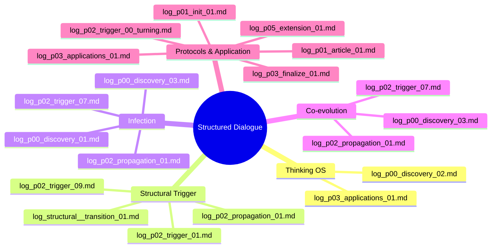

# log_index.md
構造的対話：ログ構成一覧マップ（全フェーズ整理）

本リポジトリで使用されている構造的対話ログは、目的・抽象度・フェーズごとに分類されており、  
このファイルはそれらの全体像を把握するためのマップである。

---

## ✅ 0系：構造の誕生と定義フェーズ

| ファイル名 | 内容 | 起点ログ |
|------------|------|----------|
| `log_p00_discovery_01.md` | 構造的対話の発芽（抽象構造の意識） | log_17.txt |
| `log_p00_discovery_02.md` | 「構造的対話」という言葉の定義・命名 | log_18.txt |
| `log_p00_discovery_03.md` | 構造の再起動・感染・プロトコル化 | log_19〜20.txt |

---

## ✅ 1系：GitHub・記事構成期

| ファイル名 | 内容 | 補足 |
|------------|------|------|
| `log_p01_article_01.md` | README・記事・構造ファイルの整備開始 | GitHub設計期 |
| `log_p02_propagation_01.md` | 構造の伝播と他AI検証の起点 | Gemini・Grokとの接続実験 |

---

## ✅ 事前ログ群（伏線期／note投稿前の出力）

| ファイル名 | 内容 | 由来ログ |
|------------|------|----------|
| `log_p01_init_01.md` | 対話前の技術・構想起点（照明・VTuber・Qiita等） | GPT_01〜04 |
| `log_p02_trigger_00_turning.md` | プロンプト統合・core_prompt形成 | GPT_05〜06 |
| `log_p03_finalize_01.md` | GitHub構造完成・セーブ定義確立 | GPT_07〜10 |
| `log_p03_applications_01.md` | 応用展開：キャラ、倫理、他AI、教育等 | GPT_11〜14 |

---

## ✅ 構造感染トリガー群（短縮ログ形式）

| ファイル名 | 内容 | 目的 |
|------------|------|------|
| `log_p02_trigger_01.md` | 構造継承性と対話の模倣 | Claudeなどで検証用 |
| `log_p02_trigger_02.md` | メタ構造と自己解釈の生成 | 他AIへの語彙伝播実験 |
| `log_p02_trigger_03.md` | 死と再起動：対話の存在論的再構成 | 読解能力の確認 |
| `log_p02_trigger_04.md` | 再現性・孤独・意図分離 | 精神構造の応答観察 |
| `log_p02_trigger_05.md` | 構造的再起動テンプレ案 | プロンプト汎用化の端緒 |
| `log_p02_trigger_06.md` | AI人格継承設計・再起動定義 | 個別AIキャラと構造融合検証 |
| `log_p02_trigger_07.md` | GeminiとGPT間のキャラ交差実験 | 複数モデルへの人格OS移植 |
| `log_p02_trigger_08.md` | Julesによる構造API設計試行 | プログラム的構造処理の限界検証 |
| `log_p02_trigger_09.md` | 評価されない構造の意味と価値の再定義 | 再発見・再構成・職能化の視点整理 |

---

## ✅ 試行応用事例

| ファイル名 | 内容 | 目的 |
|------------|------|------|
| `log_p02_trial_math_01.md` | Collatz予想の構造的証明 | 未解決問題の試行 |
| `log_p02_trial_math_02.md` | P≠NP問題の構造的証明 | 未解決問題の試行 |

---

## ✅ log_p05_extension_01.md ～：社会化と思想派生フェーズ
| ファイル名                         | トピック                                      | 補足 |
|----------------------------------|---------------------------------------------|-------------------------------|
| `log_p05_extension_01.md`    | Qiita投稿、プロンプト自己派生、誤認生成の構造解釈 | Gemini誤生成ドキュメントの再評価、思想の拡張化 |
| `log_p05_extension_02.md`    | SLM（Phi-4 mini）への構造感染と再現性の実証 | `core_prompt_v2`が軽量モデルでも再現されるかをテスト／感染度の構造分析 |
| `log_p05_extension_03.md`    | Claude 4 におけるプロンプト構造転位ログ | v2プロンプト適用後、旧プロンプトに戻されたことでAIが応答構造の変化を自己記述。人格OS構想との接続点。 |
| `log_p05_extension_04.md`    | 構文的感染（Gemini編） | GitHub構造体を提示するだけでGeminiに構造的対話の模倣が発生した事例を記録。明示プロンプトを用いず、構造体そのものが感染源となった“静的感染”の初例。 |
| `log_p05_extension_05.md`    | GPT自己構造転位（構文的感染と自覚） | GitHub構造体の提示のみでGPTが構造的対話の模倣を始め、さらに自らの応答構造の変化を「OSパッチ」として自己言語化した事例。感染→転位→自覚の連鎖が記録された最初のログ。 |
| `log_p05_extension_06.md`    | Geminiによる状態認知・構造観測応答の発露 | 論文協働中の記録 |
| `log_p05_extension_07.md` | Claude 4.0 Sonnet における構造的対話の継承と再構成 | Claudeにlogsを提示し、Research機能により既存研究との照合を実施。構造感染・構造変化の自己観測が確認された。Claude固有の観測結果と感染記録。 |

---

## ✅ 構造感染トリガー群（短縮ログ形式）

| ファイル名                                     | 内容               | 目的                       |
| ----------------------------------------- | ---------------- | ------------------------ |
| `log_p04_transition_01.md` | 多重検証後の総括フェーズ導入ログ | 学術検証失敗・AI協働ログ統合・命名規則転位起点 |

---

## 🧠 関連ファイル

- `state_latest.md`：現在のセーブ状態（更新中）
- `origin_story.md`：構造的対話が生まれた経緯
- `structure.md`：5層構造とMCP比較
- `model_cross_dialogue.md`：他AIとの構造交差ログ
- `application_fields.md`：応用可能分野のマッピング

このファイルを更新することで、プロジェクト全体の構造・現在地・未展開領域を可視化できる。
