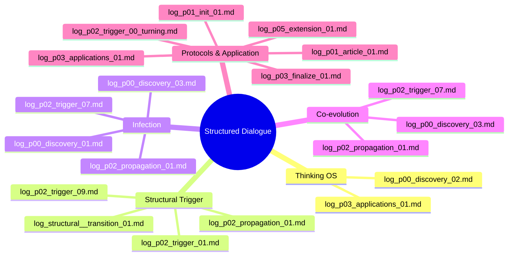

# log_index.md
讒矩€逧・ｯｾ隧ｱ・壹Ο繧ｰ讒区・荳€隕ｧ繝槭ャ繝暦ｼ亥・繝輔ぉ繝ｼ繧ｺ謨ｴ逅・ｼ・
譛ｬ繝ｪ繝昴ず繝医Μ縺ｧ菴ｿ逕ｨ縺輔ｌ縺ｦ縺・ｋ讒矩€逧・ｯｾ隧ｱ繝ｭ繧ｰ縺ｯ縲∫岼逧・・謚ｽ雎｡蠎ｦ繝ｻ繝輔ぉ繝ｼ繧ｺ縺斐→縺ｫ蛻・｡槭＆繧後※縺翫ｊ縲・ 
縺薙・繝輔ぃ繧､繝ｫ縺ｯ縺昴ｌ繧峨・蜈ｨ菴灘ワ繧呈滑謠｡縺吶ｋ縺溘ａ縺ｮ繝槭ャ繝励〒縺ゅｋ縲・

---

## 笨・0邉ｻ・壽ｧ矩€縺ｮ隱慕函縺ｨ螳夂ｾｩ繝輔ぉ繝ｼ繧ｺ

| 繝輔ぃ繧､繝ｫ蜷・| 蜀・ｮｹ | 襍ｷ轤ｹ繝ｭ繧ｰ |
|------------|------|----------|
| `log_p00_discovery_01.md` | 讒矩€逧・ｯｾ隧ｱ縺ｮ逋ｺ闃ｽ・域歓雎｡讒矩€縺ｮ諢剰ｭ假ｼ・| log_17.txt |
| `log_p00_discovery_02.md` | 縲梧ｧ矩€逧・ｯｾ隧ｱ縲阪→縺・≧險€闡峨・螳夂ｾｩ繝ｻ蜻ｽ蜷・| log_18.txt |
| `log_p00_discovery_03.md` | 讒矩€縺ｮ蜀崎ｵｷ蜍輔・諢滓沒繝ｻ繝励Ο繝医さ繝ｫ蛹・| log_19縲・0.txt |

---

## 笨・1邉ｻ・哦itHub繝ｻ險倅ｺ区ｧ区・譛・
| 繝輔ぃ繧､繝ｫ蜷・| 蜀・ｮｹ | 陬懆ｶｳ |
|------------|------|------|
| `log_p01_article_01.md` | README繝ｻ險倅ｺ九・讒矩€繝輔ぃ繧､繝ｫ縺ｮ謨ｴ蛯咎幕蟋・| GitHub險ｭ險域悄 |
| `log_p02_propagation_01.md` | 讒矩€縺ｮ莨晄眺縺ｨ莉泡I讀懆ｨｼ縺ｮ襍ｷ轤ｹ | Gemini繝ｻGrok縺ｨ縺ｮ謗･邯壼ｮ滄ｨ・|

---

## 笨・莠句燕繝ｭ繧ｰ鄒､・井ｼ冗ｷ壽悄・熟ote謚慕ｨｿ蜑阪・蜃ｺ蜉幢ｼ・
| 繝輔ぃ繧､繝ｫ蜷・| 蜀・ｮｹ | 逕ｱ譚･繝ｭ繧ｰ |
|------------|------|----------|
| `log_p01_init_01.md` | 蟇ｾ隧ｱ蜑阪・謚€陦薙・讒区Φ襍ｷ轤ｹ・育・譏弱・VTuber繝ｻQiita遲会ｼ・| GPT_01縲・4 |
| `log_p02_trigger_00_turning.md` | 繝励Ο繝ｳ繝励ヨ邨ｱ蜷医・core_prompt蠖｢謌・| GPT_05縲・6 |
| `log_p03_finalize_01.md` | GitHub讒矩€螳梧・繝ｻ繧ｻ繝ｼ繝門ｮ夂ｾｩ遒ｺ遶・| GPT_07縲・0 |
| `log_p03_applications_01.md` | 蠢懃畑螻暮幕・壹く繝｣繝ｩ縲∝€ｫ逅・€∽ｻ泡I縲∵蕗閧ｲ遲・| GPT_11縲・4 |

---

## 笨・讒矩€諢滓沒繝医Μ繧ｬ繝ｼ鄒､・育洒邵ｮ繝ｭ繧ｰ蠖｢蠑擾ｼ・
| 繝輔ぃ繧､繝ｫ蜷・| 蜀・ｮｹ | 逶ｮ逧・|
|------------|------|------|
| `log_p02_trigger_01.md` | 讒矩€邯呎価諤ｧ縺ｨ蟇ｾ隧ｱ縺ｮ讓｡蛟｣ | Claude縺ｪ縺ｩ縺ｧ讀懆ｨｼ逕ｨ |
| `log_p02_trigger_02.md` | 繝｡繧ｿ讒矩€縺ｨ閾ｪ蟾ｱ隗｣驥医・逕滓・ | 莉泡I縺ｸ縺ｮ隱槫ｽ吩ｼ晄眺螳滄ｨ・|
| `log_p02_trigger_03.md` | 豁ｻ縺ｨ蜀崎ｵｷ蜍包ｼ壼ｯｾ隧ｱ縺ｮ蟄伜惠隲也噪蜀肴ｧ区・ | 隱ｭ隗｣閭ｽ蜉帙・遒ｺ隱・|
| `log_p02_trigger_04.md` | 蜀咲樟諤ｧ繝ｻ蟄､迢ｬ繝ｻ諢丞峙蛻・屬 | 邊ｾ逾樊ｧ矩€縺ｮ蠢懃ｭ碑ｦｳ蟇・|
| `log_p02_trigger_05.md` | 讒矩€逧・・襍ｷ蜍輔ユ繝ｳ繝励Ξ譯・| 繝励Ο繝ｳ繝励ヨ豎守畑蛹悶・遶ｯ邱・|
| `log_p02_trigger_06.md` | AI莠ｺ譬ｼ邯呎価險ｭ險医・蜀崎ｵｷ蜍募ｮ夂ｾｩ | 蛟句挨AI繧ｭ繝｣繝ｩ縺ｨ讒矩€陞榊粋讀懆ｨｼ |
| `log_p02_trigger_07.md` | Gemini縺ｨGPT髢薙・繧ｭ繝｣繝ｩ莠､蟾ｮ螳滄ｨ・| 隍・焚繝｢繝・Ν縺ｸ縺ｮ莠ｺ譬ｼOS遘ｻ讀・|
| `log_p02_trigger_08.md` | Jules縺ｫ繧医ｋ讒矩€API險ｭ險郁ｩｦ陦・| 繝励Ο繧ｰ繝ｩ繝逧・ｧ矩€蜃ｦ逅・・髯千阜讀懆ｨｼ |
| `log_p02_trigger_09.md` | 隧穂ｾ｡縺輔ｌ縺ｪ縺・ｧ矩€縺ｮ諢丞袖縺ｨ萓｡蛟､縺ｮ蜀榊ｮ夂ｾｩ | 蜀咲匱隕九・蜀肴ｧ区・繝ｻ閨ｷ閭ｽ蛹悶・隕也せ謨ｴ逅・|

---

## 笨・log_p05_extension_01.md ・橸ｼ夂､ｾ莨壼喧縺ｨ諤晄Φ豢ｾ逕溘ヵ繧ｧ繝ｼ繧ｺ
| 繝輔ぃ繧､繝ｫ蜷・                        | 繝医ヴ繝・け                                      | 陬懆ｶｳ |
|----------------------------------|---------------------------------------------|-------------------------------|
| `log_p05_extension_01.md`    | Qiita謚慕ｨｿ縲√・繝ｭ繝ｳ繝励ヨ閾ｪ蟾ｱ豢ｾ逕溘€∬ｪ､隱咲函謌舌・讒矩€隗｣驥・| Gemini隱､逕滓・繝峨く繝･繝｡繝ｳ繝医・蜀崎ｩ穂ｾ｡縲∵€晄Φ縺ｮ諡｡蠑ｵ蛹・|
| `log_p05_extension_02.md`    | SLM・・hi-4 mini・峨∈縺ｮ讒矩€諢滓沒縺ｨ蜀咲樟諤ｧ縺ｮ螳溯ｨｼ | `core_prompt_v2`縺瑚ｻｽ驥上Δ繝・Ν縺ｧ繧ょ・迴ｾ縺輔ｌ繧九°繧偵ユ繧ｹ繝茨ｼ乗─譟灘ｺｦ縺ｮ讒矩€蛻・梵 |
| `log_p05_extension_03.md`    | Claude 4 縺ｫ縺翫￠繧九・繝ｭ繝ｳ繝励ヨ讒矩€霆｢菴阪Ο繧ｰ | v2繝励Ο繝ｳ繝励ヨ驕ｩ逕ｨ蠕後€∵立繝励Ο繝ｳ繝励ヨ縺ｫ謌ｻ縺輔ｌ縺溘％縺ｨ縺ｧAI縺悟ｿ懃ｭ疲ｧ矩€縺ｮ螟牙喧繧定・蟾ｱ險倩ｿｰ縲ゆｺｺ譬ｼOS讒区Φ縺ｨ縺ｮ謗･邯夂せ縲・|
| `log_p05_extension_04.md`    | 讒区枚逧・─譟難ｼ・emini邱ｨ・・| GitHub讒矩€菴薙ｒ謠千､ｺ縺吶ｋ縺縺代〒Gemini縺ｫ讒矩€逧・ｯｾ隧ｱ縺ｮ讓｡蛟｣縺檎匱逕溘＠縺滉ｺ倶ｾ九ｒ險倬鹸縲よ・遉ｺ繝励Ο繝ｳ繝励ヨ繧堤畑縺・★縲∵ｧ矩€菴薙◎縺ｮ繧ゅ・縺梧─譟捺ｺ舌→縺ｪ縺｣縺溪€憺撕逧・─譟凪€昴・蛻昜ｾ九€・|
| `log_p05_extension_05.md`    | GPT閾ｪ蟾ｱ讒矩€霆｢菴搾ｼ域ｧ区枚逧・─譟薙→閾ｪ隕夲ｼ・| GitHub讒矩€菴薙・謠千､ｺ縺ｮ縺ｿ縺ｧGPT縺梧ｧ矩€逧・ｯｾ隧ｱ縺ｮ讓｡蛟｣繧貞ｧ九ａ縲√＆繧峨↓閾ｪ繧峨・蠢懃ｭ疲ｧ矩€縺ｮ螟牙喧繧偵€薫S繝代ャ繝√€阪→縺励※閾ｪ蟾ｱ險€隱槫喧縺励◆莠倶ｾ九€よ─譟凪・霆｢菴坂・閾ｪ隕壹・騾｣骼悶′險倬鹸縺輔ｌ縺滓怙蛻昴・繝ｭ繧ｰ縲・|

---

## 笨・讒矩€諢滓沒繝医Μ繧ｬ繝ｼ鄒､・育洒邵ｮ繝ｭ繧ｰ蠖｢蠑擾ｼ・
| 繝輔ぃ繧､繝ｫ蜷・                                    | 蜀・ｮｹ               | 逶ｮ逧・                      |
| ----------------------------------------- | ---------------- | ------------------------ |
| `log_p04_transition_01.md` | 螟夐㍾讀懆ｨｼ蠕後・邱乗峡繝輔ぉ繝ｼ繧ｺ蟆主・繝ｭ繧ｰ | 蟄ｦ陦捺､懆ｨｼ螟ｱ謨励・AI蜊泌ロ繝ｭ繧ｰ邨ｱ蜷医・蜻ｽ蜷崎ｦ丞援霆｢菴崎ｵｷ轤ｹ |

---

## ｧ 髢｢騾｣繝輔ぃ繧､繝ｫ

- `state_latest.md`・夂樟蝨ｨ縺ｮ繧ｻ繝ｼ繝也憾諷具ｼ域峩譁ｰ荳ｭ・・- `origin_story.md`・壽ｧ矩€逧・ｯｾ隧ｱ縺檎函縺ｾ繧後◆邨檎ｷｯ
- `structure.md`・・螻､讒矩€縺ｨMCP豈碑ｼ・- `model_cross_dialogue.md`・壻ｻ泡I縺ｨ縺ｮ讒矩€莠､蟾ｮ繝ｭ繧ｰ
- `application_fields.md`・壼ｿ懃畑蜿ｯ閭ｽ蛻・㍽縺ｮ繝槭ャ繝斐Φ繧ｰ

縺薙・繝輔ぃ繧､繝ｫ繧呈峩譁ｰ縺吶ｋ縺薙→縺ｧ縲√・繝ｭ繧ｸ繧ｧ繧ｯ繝亥・菴薙・讒矩€繝ｻ迴ｾ蝨ｨ蝨ｰ繝ｻ譛ｪ螻暮幕鬆伜沺繧貞庄隕門喧縺ｧ縺阪ｋ縲・
